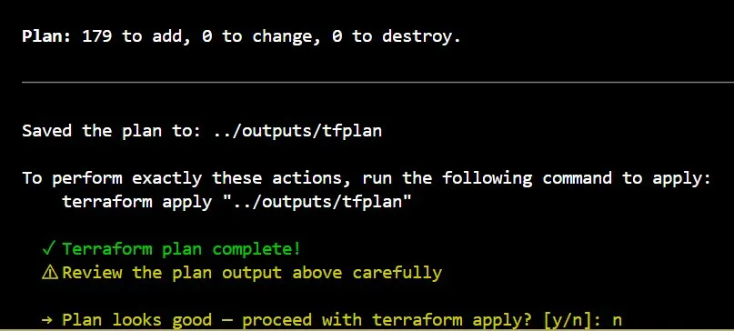
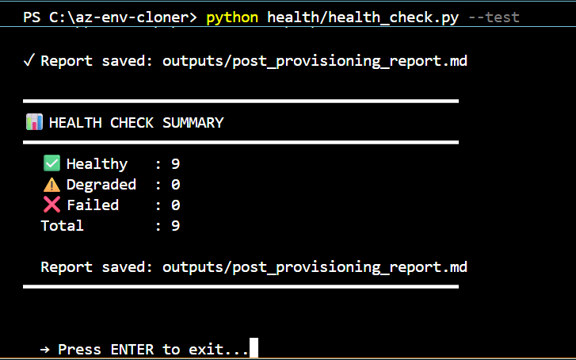

# az-env-cloner

Clones Azure Resource Groups across environments using Python + Terraform.
Point it at a source RG -> it discovers, renames, validates and provisions with your approval before anything touches Azure.

## What it does

Reads a source Resource Group, transforms resource names (dev -> pat, pat -> prod, or any combination), provisions identical infrastructure in a new RG using Terraform, auto-updates connection strings, and generates a health report when done.

**Solves:** Standing up new environments manually takes days. This takes under an hour.

---

## How it works
```
discover -> transform names -> your review -> terraform plan -> your approval -> apply -> health check
```

---

## What gets cloned

VMs · App Services · Function Apps · Storage Accounts · CosmosDB · EventHub · VNets · NSGs · Private Endpoints

---

## Key features

- Names transformed automatically (`pat` -> `dev` everywhere, case-preserved)
- Connection strings auto-updated across subscription
- Interactive pre-flight checklist before provisioning
- Post-provisioning health check + troubleshooting report
- Resume capability if interrupted

---

## Proof

**179 resources planned against real Azure environment:**



**All resources verified healthy:**



---

## Stack

`Python 3.12` · `Terraform 1.14` · `Azure SDK` · `Azure Key Vault` · `GitHub Actions`

---

## Quick start
```bash
git clone https://github.com/shirleyjudia/az-env-cloner.git
pip install -r requirements.txt
az login
python orchestrate.py
```

---

## Author
**Shirley Judia** - Cloud & Infrastructure Engineer
[LinkedIn](https://linkedin.com/in/shirley-judia)